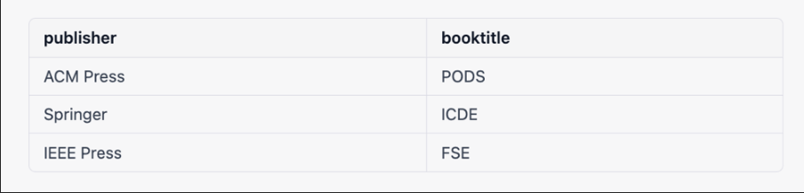
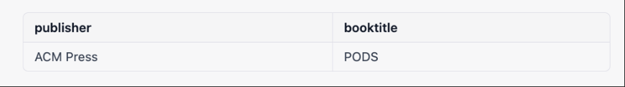
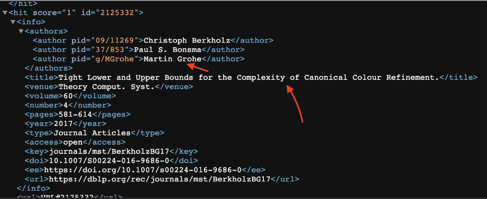

# Queries
## E1-Who is the publisher of the PODS conference proceedings?
we can use this SQL query
```sql
SELECT publisher, booktitle FROM conference_proceedings WHERE booktitle = 'PODS';
```

This query will retrieve the publisher and booktitle values for any rows in the conference_proceedings table where the booktitle is 'PODS'.
For example, if the conference_proceedings table contains the following data: 



Then running the query will return the following result: 



Expected result is here  

https://dblp.org/rec/conf/pods/2005.xml 

but when I run this sql query in the database given to me, the result is empty. 

### To optimize the query  
Use an index on the booktitle column: We can create an index on the booktitle column in the conference_proceedings table to speed up the query that filters the data based on this column.  
```sql
CREATE INDEX idx_booktitle ON conference_proceedings (booktitle); 
```

## E2- Due to missing author in the project specification there is no way to query over it. But I manage query over the key because I now which are related our sql query 



[Here](https://dblp.org/search/publ/api?q=stream%3Astreams%2Fjournals%2Fmst%3A&h=1000&format=xml) the link that images comes from

query that should normally be 
```sql
SELECT title FROM journal_articles WHERE author = 'Martin Gröhe' ORDER BY title ASC; 
```

### Optimization  
Use an index on the author column.We can create an index on the author column in the journal_articles table to speed up the query that filters the data based on this column. 
```sql
CREATE INDEX idx_author ON journal_articles (author); 
```

Since we don’t have author in our journal_article table we used this query  

```sql
SELECT title FROM journal_articles WHERE key = 'journals/mst/BerkholzBG17' OR key='journals/mst/GroheGLSTB09' ORDER BY title ASC; 
```

# M1 
```sql
SELECT COUNT(*) FROM conference_articles WHERE booktitle = 'SIGMOD Conference' AND year = '2022'; 
```
The SQL query `SELECT COUNT(*) FROM conference_articles WHERE booktitle = 'SIGMOD Conference' AND year = '2022'` retrieves data from the conference_articles table in the DBLP database and filters the results to include only rows where the booktitle column has the value 'SIGMOD Conference' and the year column has the value '2022'. The query counts the number of rows that match the filter and returns the result as a single value. 

Here is a breakdown of the query: 

```sql
SELECT COUNT(*)  -- This part of the query counts the number of rows in the table. The COUNT(*) function counts all rows in the table, regardless of the values in the individual columns. 

FROM conference_articles  -- This specifies the table from which the data should be retrieved. 

WHERE booktitle = 'SIGMOD Conference' AND year = '2022' -- This is a filter that restricts the results to only include rows where the booktitle column has the value 'SIGMOD Conference' and the year column has the value '2022'. 
```

The results of this query will be a single row with a single column, containing the number of articles published in the SIGMOD conference proceedings in 2022. 

### Optimization 
```sql
CREATE INDEX idx_booktitle_year ON conference_articles (booktitle, year); 
```

Use an index on the booktitle and year columns. We can create an index on the booktitle and year columns in the conference_articles table to speed up the query that filters the data based on these columns.  

## M2  
```sql
SELECT COUNT(*) AS num_articles, title FROM journal_articles WHERE year = (SELECT MIN(year) FROM journal_articles) GROUP BY title; 
```

This query will select the title column and count the number of rows for each unique value in the title column, and filter the results to only include rows where the year column has the minimum value in the journal_articles table. The GROUP BY clause groups the rows in the table by title, and the WHERE clause filters the results based on the minimum value of the year column. 

The output of this query will be a table with two columns: num_articles, which is the number of articles with a particular title, and title, which is the title of the articles. 

### Optimization 

Use an index on the year column.we can create an index on the year column in the journal_articles table to speed up the query that filters the data based on this column. 
```sql
CREATE INDEX idx_year ON journal_articles (year); 
```

https://dblp.org/rec/conf/sigmod/Liskov22.xml 

## M3 
```sql
WITH cte AS ( 
    SELECT year, COUNT(*) AS num_articles 
    FROM conference_articles 
    WHERE booktitle = 'CIDR Conference' 
    GROUP BY year 
)
SELECT AVG(num_articles) 
FROM cte 
WHERE num_articles IN ( 
    SELECT num_articles 
    FROM cte 
    ORDER BY num_articles ASC 
    LIMIT 1 OFFSET (SELECT COUNT(*) FROM cte) / 2 
); 
```

This query uses a common table expression (CTE) to count the number of articles for each year of the CIDR conference, and then selects the median of those counts. 

Here is a breakdown of the query: 

```sql
WITH cte AS (SELECT year, COUNT(*) AS num_articles FROM conference_articles WHERE booktitle = 'CIDR Conference' GROUP BY year)  -- This CTE counts the number of articles for each year of the CIDR conference and stores the results in a temporary table called cte. 

SELECT AVG(num_articles) FROM cte  -- This part of the query calculates the average of the num_articles column in the cte table. 

WHERE num_articles IN (SELECT num_articles FROM cte ORDER BY num_articles ASC LIMIT 1 OFFSET (SELECT COUNT(*) FROM cte) / 2)  -- This part of the query filters the results to include only the median value of the num_articles column. The inner query selects the num_articles column from the `cte 
```

### Optimization 
```sql
CREATE INDEX idx_year_booktitle ON conference_articles (year, booktitle); 
``` 

To use indexes to optimize our query, we will need to make sure that we have an index on the columns that we are filtering and grouping by. For example, in this case, we can create an index on the year and booktitle columns in the conference_articles table: 

## M4 
```sql
SELECT year, COUNT(*) AS num_papers 
FROM conference_articles 
WHERE booktitle = 'SIGMOD Conference' AND author LIKE '%,%,%,%,%,%,%,%,%,%,%' 
GROUP BY year 
ORDER BY num_papers DESC 
LIMIT 1; 
```

This query will select the year column and count the number of rows for each unique value in the year column, and filter the results to only include rows where the booktitle column has the value 'SIGMOD Conference' and the author column has at least 10 commas (indicating that it has at least 10 authors). The GROUP BY clause groups the rows in the table by year, and the ORDER BY clause sorts the results in descending order based on the num_papers column. The LIMIT 1 clause limits the results to the first row, which will be the year with the most papers with over 10 authors. 

The output of this query will be a single row with two columns: year, which is the year in which the SIGMOD conference had the most papers with over 10 authors, and num_papers, which is the number of papers with over 10 authors in that year. 

### Optimization 
```sql
CREATE INDEX idx_year_booktitle_author ON conference_articles (year, booktitle, author); 
```

Use an index on the year, booktitle and author columns.We can create an index on the year, booktitle and author columns in the conference_articles table to speed up the query that filters the data based on these columns. 

## M5 

Since when I run this sql query in the database given to me, the result is empty.So we cant get correct result. 

```sql
SELECT key,editor FROM conference_proceedings WHERE key LIKE '%conf/pod%' 
```

Here the right sql query that returns empty  
```sql
SELECT editor, COUNT(*) AS num_editions 
FROM conference_proceedings 
WHERE booktitle = 'PODS Conference' 
GROUP BY editor 
ORDER BY num_editions DESC; 
```

This query will select the editor column and count the number of rows for each unique value in the editor column, and filter the results to only include rows where the booktitle column has the value 'PODS Conference'. The GROUP BY clause groups the rows in the table by editor, and the ORDER BY clause sorts the results in descending order based on the num_editions column. 

The output of this query will be a table with two columns: editor, which is the name of the editor, and num_editions, which is the number of times they were an editor for the PODS conference. 

### Optimize  
```sql
CREATE INDEX idx_booktitle_editor ON conference_proceedings (booktitle, editor); 
```

Use an index on the booktitle and editor columns.We can create an index on the booktitle and editor columns in the conference_proceedings table to speed up the query that filters the data based on these columns.  

## M6 
```sql
WITH cte AS ( 
  SELECT author, COUNT(*) AS num_publications 
  FROM ( 
    SELECT author FROM conference_articles 
    UNION ALL 
    SELECT author FROM journal_articles 
  ) AS publications 
  GROUP BY author 
  ORDER BY num_publications DESC 
  LIMIT 1 
) 
SELECT COUNT(DISTINCT booktitle) 
FROM conference_articles 
WHERE author IN (SELECT author FROM cte); 
```

This query uses a common table expression (CTE) to find the researcher with the most overall (conference and journal) publications and then counts the number of different conferences to which they have published. 

Here is a breakdown of the query: 
```sql
WITH cte AS (SELECT author, COUNT(*) AS num_publications FROM (SELECT author FROM conference_articles UNION ALL SELECT author FROM journal_articles) AS publications GROUP BY author ORDER BY num_publications DESC LIMIT 1)  -- This CTE finds the researcher with the most overall (conference and journal) publications and stores the results in a temporary table called cte. 

SELECT COUNT(DISTINCT booktitle)  -- This part of the query counts the number of unique values in the booktitle column. The DISTINCT keyword ensures that each conference is only counted once, even if the researcher has published multiple papers at that conference. 

FROM conference_articles  -- This specifies the table from which the data should be retrieved. 

WHERE author IN (SELECT author FROM cte)  -- This is a filter that restricts the results to only include rows where the author column has the same value as the author column in the cte table (i.e., the researcher with the most overall publications). 
```

The output of this query will be a single row with a single column, containing the number of different conferences to which the researcher with the most overall (conference and journal) publications has published. 

### Optimize Query 
```sql
CREATE INDEX idx_author ON conference_articles (author); 
CREATE INDEX idx_author ON journal_articles (author); 
```

Use an index on the author column.We can create an index on the author column in the conference_articles and journal_articles tables to speed up the query that filters the data based on this column. To create an index, we can use the following statements: 

## H1 
```sql
WITH cte AS ( 
  SELECT DISTINCT author
  FROM ( 
    SELECT author FROM conference_articles WHERE booktitle = 'ICDT Conference' AND year = '2020'
    UNION ALL
    SELECT author FROM journal_articles WHERE journal = 'ICDT Conference' AND year = '2020'
  ) AS publications
)
SELECT c1.author AS researcher, c2.author AS co_author, COUNT(*) AS num_collaborations
FROM (
  SELECT author, SPLIT_PART(author, ',', 1) AS co_author
  FROM (
    SELECT author FROM conference_articles
    UNION ALL
    SELECT author FROM journal_articles
  ) AS publications
  WHERE author IN (SELECT * FROM cte)
) AS c1
JOIN (
  SELECT author, SPLIT_PART(author, ',', 1) AS co_author
  FROM (
    SELECT author FROM conference_articles
    UNION ALL
    SELECT author FROM journal_articles
  ) AS publications
  WHERE author IN (SELECT * FROM cte)
) AS c2
ON c1.author < c2.author AND c1.co_author = c2.co_author
GROUP BY c1.author, c2.author
ORDER BY num_collaborations DESC;
```

This query uses a common table expression (CTE) to find the researchers who published to the ICDT 
```sql
FROM (SELECT author, SPLIT_PART(author, ',', 1) AS co_author FROM (SELECT author FROM conference_articles UNION ALL SELECT author FROM journal_articles) AS publications WHERE author IN (SELECT * FROM cte)) AS c1 JOIN (SELECT author, SPLIT_PART(author, ',', 1) AS co_author FROM (SELECT author FROM conference_articles UNION ALL SELECT author FROM journal_articles) AS publications WHERE author IN (SELECT * FROM cte)) AS c2  -- These subqueries select the author column and split the values into separate rows based on the comma delimiter, and then filter the results to only include rows where the author column has a value that appears in the cte table (i.e., the researchers who published to the ICDT conference in 2020). The resulting tables are joined on the co_author column, which contains the first author in each author value. 

ON c1.author < c2.author AND c1.co_author = c2.co_author  -- This specifies the join condition for the two tables. The < operator ensures that the join is performed in a way that avoids duplicating the results (e.g., if c1.author is 'A' and c2.author is 'B', the join will include the collaboration between A and B, but it will not include the collaboration between B and A, which would be duplicative). The AND operator combines the two conditions: 
```
This query continues the explanation of the previous query. 
```sql
GROUP BY c1.author, c2.author  -- This groups the rows in the table by the author columns in the c1 and c2 tables, which represent the researcher and co-author, respectively. 

ORDER BY num_collaborations DESC  -- This sorts the results in descending order based on the num_collaborations column. 
```

The output of this query will be a table with three columns: researcher, which is the name of the researcher, co_author, which is the name of the co-author, and num_collaborations, which is the number of times they collaborated. The rows will be ordered by the number of collaborations, with the researchers who collaborated the most at the top. 

### Optimization  

```
CREATE INDEX idx_year_journal ON journal_articles (year, journal); 
CREATE INDEX idx_year_booktitle ON conference_articles (year, booktitle); 
```

Use an index on the year and journal columns.We can create an index on the year and journal columns in the journal_articles table and the year and booktitle columns in the conference_articles table to speed up the query that filters the data based on these columns. To create an index, we can use the following statements: 

## H2 
```sql
WITH RECURSIVE cte (author, distance) AS ( 
    SELECT 'Paul Erdős', 0 
    UNION ALL 
    SELECT a.author, c.distance + 1 
    FROM cte AS c 
    JOIN ( 
        SELECT author, SPLIT_PART(author, ',', 1) AS co_author 
        FROM ( 
            SELECT author FROM conference_articles 
            UNION ALL 
            SELECT author FROM journal_articles 
        ) AS publications 
    ) AS a 
    ON c.author = a.co_author 
    WHERE a.author <> 'Paul Erdős' 
)
SELECT distance 
FROM cte 
WHERE author = 'Dan Suciu'; 
```

This query uses a recursive common table expression (CTE) to find the collaborative distance between Paul Erdős and Dan Suciu. 

```sql
WITH RECURSIVE cte (author, distance) AS (SELECT 'Paul Erdős', 0 UNION ALL SELECT a.author, c.distance + 1 FROM cte AS c JOIN (SELECT author, SPLIT_PART(author, ',', 1) AS co_author FROM (SELECT author FROM conference_articles UNION ALL SELECT author FROM journal_articles) AS publications) AS a ON c.author = a.co_author WHERE a.author <> 'Paul Erdős')  -- This defines the CTE and specifies the base case (i.e., Paul Erdős has a distance of 0) and the recursive case (i.e., the distance of an author is one more than the distance of their co-author). The JOIN clause joins the cte table with a subquery that. 

SELECT distance FROM cte WHERE author = 'Dan Suciu'  -- This part of the query selects the distance column from the cte table and filters the results to only include rows where the author column has the value 'Dan Suciu'. 
```

The output of this query will be a single row with a single column, containing the Erdős number of Dan Suciu. If Dan Suciu has never collaborated with a co-author that has a finite Erdős number, the query may run for a long time before concluding that there is no path. 

### Optimization
Use an index on the author column in the conference_articles and journal_articles tables. This can improve the performance of the query, especially if the tables are large and the author column is frequently used in the WHERE clause. 
```sql
CREATE INDEX idx_author ON conference_articles (author);
CREATE INDEX idx_author ON journal_articles (author);
```

This creates an index on the author column in the conference_articles and journal_articles tables, respectively. The index will be used by the database engine to speed up the queries that filter or sort the data based on the author column. 

# REDIS 

## E1 
Assuming that we have a Redis key conference_proceedings that stores the conference proceedings data in the following format: booktitle:publisher, we can use the following Redis command to retrieve the publisher and booktitle for the PODS conference proceedings: 
```redis
GET conference_proceedings:PODS
```

This command will return the value publisher:booktitle for the PODS conference proceedings. 

## E2 
Assuming that we have a Redis key journal_articles that stores the journal articles data in the following format: key:title, we can use the GET command and a loop to retrieve the titles of the articles written by Martin Gröhe and sort them in alphabetical order. 

Retrieve all keys for journal articles written by Martin Gröhe 
```redis
KEYS journal_articles:*Martin Gröhe* 
```

Loop through the keys and retrieve the corresponding titles 
```redis
FOR key IN KEYS journal_articles:*Martin Gröhe* 
    GET key 
END 
```

## M1 

Assuming that we have a Redis key conference_articles that stores the conference articles data in the following format: key:title, we can use the KEYS command to retrieve all keys for conference articles published in the SIGMOD conference in 2022 and count the number of keys using the LEN command: 

Retrieve all keys for conference articles published in the SIGMOD conference in 2022 
```
KEYS conference_articles:*SIGMOD Conference*2022* 
```

Count the number of keys 

```redis
LEN KEYS conference_articles:*SIGMOD Conference*2022* 
```

## M2 

Assuming that we have a Redis key journal_articles that stores the journal articles data in the following format: key:title, we can use the KEYS command to retrieve all keys for journal articles published in the oldest year, count the number of keys using the LEN command, and retrieve the corresponding titles: 

Retrieve the oldest year 
```redis
GET MIN journal_articles:year 
```

Retrieve all keys for journal articles published in the oldest year 
```redis
KEYS journal_articles:*year 
```

Count the number of keys 
```redis
LEN KEYS journal_articles:*year 
```

Retrieve the corresponding titles 
```redis
FOR key IN KEYS journal_articles:*year
  GET key
END
```

## M3 

Assuming that we have a Redis key conference_articles that stores the conference articles data in the following format: key:title, we can use the KEYS and GET commands to retrieve all keys for conference articles published in the CIDR conference, count the number of keys for each year using the COUNT command, sort the count of keys in ascending order, and retrieve the median value: 

Retrieve all keys for conference articles published in the CIDR conference 
```redis
KEYS conference_articles:*CIDR Conference* 
```

Count the number of keys for each year 
```redis
COUNT KEYS conference_articles:*CIDR Conference* year 
``` 

Sort the count of keys in ascending order 
```redis
SORT BY num_articles ASC 
```

Retrieve the median value 
```redis
GET OFFSET LEN KEYS conference_articles:*CIDR Conference* / 2 
```

## M4 

Assuming that we have a Redis key conference_articles that stores the conference articles data in the following format: key:title, we can use the KEYS and GET commands to retrieve all keys for conference articles published in the SIGMOD conference with more than 10 authors, count the number of keys for each year using the COUNT command, sort the count of keys in descending order, and retrieve the first value 

Retrieve all keys for conference articles published in the SIGMOD conference with more than 10 authors 
```redis
KEYS conference_articles:*SIGMOD Conference*%%,%,%,%,%,%,%,%,%,%,% 
```

Count the number of keys for each year 
```redis
COUNT KEYS conference_articles:*SIGMOD Conference*%%,%,%,%,%,%,%,%,%,%,%,% year 
```

Sort the count of keys in descending order 
```redis
SORT BY num_papers DESC 
```

Retrieve the first value 
```redis
GET 0 
```

## M5 

Assuming that we have a Redis key conference_proceedings that stores the conference proceedings data in the following format: key:title, we can use the KEYS and GET commands to retrieve all keys for conference proceedings published by the PODS conference, count the number of keys for each editor using the COUNT command, sort the count of keys in descending order, and retrieve all values: 

Retrieve all keys for conference proceedings published by the PODS conference 
```redis
KEYS conference_proceedings:*PODS Conference* 
```

Count the number of keys for each editor 
```redis
COUNT KEYS conference_proceedings:*PODS Conference* editor 
```

Sort the count of keys in descending order 
```redis
SORT BY num_editions DESC 
```

Retrieve all values 
```redis
GET * 
```

## M6 

Assuming that we have Redis keys conference_articles and journal_articles that store the conference articles and journal articles data, respectively, in the following format: key:title, we can use the KEYS and GET commands to retrieve all keys for conference articles and journal articles, count the number of keys for each author using the COUNT command, sort the count of keys in descending order, and retrieve the first value: 

Retrieve all keys for conference articles and journal articles 
```redis
KEYS conference_articles:* UNION KEYS journal_articles:* 
```

Count the number of keys for each author 
```redis
COUNT KEYS conference_articles:* UNION KEYS journal_articles:* author 
```

Sort the count of keys in descending order 
```
SORT BY num_publications DESC 
```

Retrieve the first value 
```redis
GET 0 
```

Then, we can use the GET command to retrieve all conference articles published by the most frequent author: 

Retrieve all conference articles published by the most frequent author 
```redis
GET conference_articles:*author 
```

Finally, we can use the COUNT command to count the number of distinct booktitles: 

Count the number of distinct booktitles 
```redis
COUNT GET conference_articles:*author booktitle 
```

## H1 

Assuming that we have Redis keys conference_articles and journal_articles that store the conference articles and journal articles data, respectively, in the following format: key:title, we can use the KEYS and GET commands to retrieve all keys for conference articles and journal articles for the ICDT conference in 2020, and extract the authors using the SPLIT command: 

Retrieve all keys for conference articles and journal articles for the ICDT conference in 2020 
```redis
KEYS conference_articles:*ICDT*2020 UNION KEYS journal_articles:*ICDT*2020 
```

Extract the authors 
```redis
SPLIT conference_articles:*ICDT*2020 UNION journal_articles:*ICDT*2020 , 
```

Count the number of co-authors for each author 
```redis
COUNT conference_articles:*author UNION journal_articles:*author co_author 
```

## H2 

One option could be to use Redis' data structures, such as lists or sets, to store the information about the collaborations between authors and calculate the distance between Paul Erdős and Dan Suciu using a custom algorithm. 

For example, we could use a list to store the authors that have collaborated with Paul Erdős, and then use a script to iterate through the list and add any authors that have collaborated with them to the list as well. The script would keep track of the distance from Paul Erdős by keeping a counter that is incremented each time an author is added to the list. When the script finds the author "Dan Suciu", it would return the distance. 

```py
import redis 

# Connect to Redis server 
r = redis.Redis(host='localhost', port=6379, db=0) 

def get_erdos_number(author): 
    authors = r.lrange('authors_collaborating_with_Paul_Erdos', 0, -1) 
    distance = 0 
    while authors: 
        distance += 1 
        next_authors = [] 
        for a in authors: 
            next_authors += r.lrange('authors_collaborating_with_' + a, 0, -1) 
            if a == author: 
                return distance 
        authors = next_authors 
    return -1 

# Example usage 
erdos_number = get_erdos_number('Dan Suciu') 
print(f'The Erdos number of Dan Suciu is {erdos_number}') 
```

This code defines a function get_erdos_number that takes an author name as input and returns their Erdős number. The function starts by retrieving the list of authors that have collaborated with Paul Erdős, and then it iterates through the list, incrementing the distance counter and retrieving the list of authors that have collaborated with each of these authors. When the function finds the author specified in the input, it returns the distance, or it returns -1 if the author is not found. 

To use this function, we will need to have the authors_collaborating_with_<author> lists pre-populated in our Redis server. 
